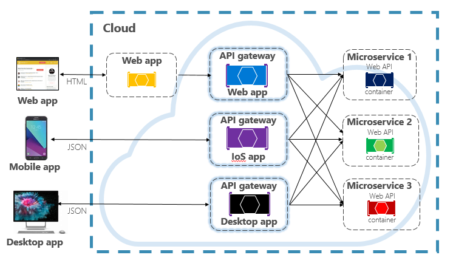

# hello-world
헬로우월드입니다.
markdown language를 쓴다.
나무위키, 위키피디아 
# 제목1
## 작은 제목
### 더 작은 제목
# 개발자 소개
|제목|내용|설명|
|------|---|---|
|이름|황준기|   |
|기술|Frontend |html, css, js, kotlin|
|    |Backend  |django, flask|
|    |Database |Oracle|

# 작품1 - django framework 활용 게시판 만들기
### 설계도

### 발표자료
[최종발표자료].(/project.pptx)
### 시연동영상
<iframe width="500" height="300" src="https://www.youtube.com/embed/P5eFbRSqy7E?list=RDP5eFbRSqy7E" title="[𝑷𝒍𝒂𝒚𝒍𝒊𝒔𝒕] 새벽감성 인디 플레이리스트 🎧 | 검정치마, 최유리, 카더가든, 데이먼스이어, 허회경, 10CM 플리" frameborder="0" allow="accelerometer; autoplay; clipboard-write; encrypted-media; gyroscope; picture-in-picture; web-share" referrerpolicy="strict-origin-when-cross-origin" allowfullscreen></iframe>
### reference
1. [네이버](https://www.naver.com)  
2. [구글](https://www.google.com)  
#사진
동영상
link 생성
link
